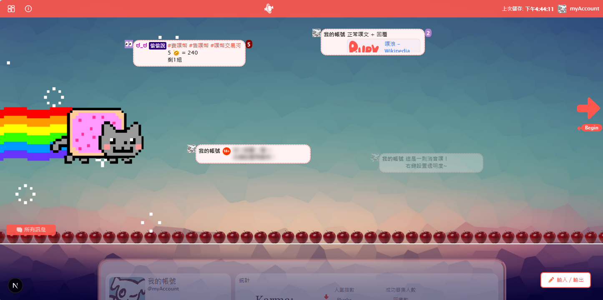

# Plurk Styler

真實畫面點擊調整，免敲程式碼即可隨改隨看；一鍵匯出CSS，貼回噗浪立即生效。

*即時預覽模擬個人主頁；對想改的區塊按右鍵即可調整。*

---

## 這是什麼

不用手寫選擇器，也能做出可上站的噗浪自訂佈景風格。
畫面中央是模擬個人主頁；右鍵呼叫對應控制項，預覽立刻更新，再匯出 CSS 貼回噗浪。

目前開放**免登入編輯器**。會員與雲端專案管理尚未對外開放；開放後仍會保留免登入編輯器給所有訪客使用。

---

## 三步驟

1. **打開** `/editor`，不需帳號。
2. **右鍵**河道、噗寶、噗文或主控台，用色盤／滑桿／上傳調整；預覽立刻更新。
3. **匯出** CSS（右下角輸入／輸出 → 匯出），複製或下載後貼進 Plurk 自訂樣式並儲存。

### 現在可以調什麼

| 區塊          | 可調項目                                   |
| ----------- | -------------------------------------- |
| 河道背景        | 背景圖（上傳或網址）與相關屬性                        |
| 時間軸裝飾       | 裝飾圖、尺寸／重複／位置                           |
| 噗寶（動態 Logo） | 自訂圖、大小、雙 calc 位置、四角與微調                 |
| 噗文外觀        | 底色、邊框與圓角                               |
| 回應數徽章       | 已讀／未讀底色與文字色、圓角                         |
| R18         | 未展開內文模糊強度                              |
| 消音噗         | 透明度                                    |
| 偷偷說         | qualifier 背景色                          |
| 主控台         | 外殼透明度／hover／邊框；區塊卡片；好友粉絲頭像列顯隱；Karma 顯隱 |

控制項以「在真實噗浪驗證會生效」為優先持續增加。

### 草稿、匯入、匯出

- **草稿**：約每 30 秒寫入瀏覽器 localStorage，關分頁再開仍在。
- **匯入**：貼上既有 CSS 匯入編輯器；若註解被移除或片段無法解析，對話框會列出差異與實際匯入內容。
- **匯出**：複製、下載 `.css`、或產生分享連結；可選擇是否附註解標記。
- **回復初始模板**：清除匯入、手動修改與瀏覽器草稿。

---

## 技術概覽

**Stack**（見 `package.json`）：Next.js 15、React 19、TypeScript、Zustand、Prisma、NextAuth、Tailwind CSS 4、Radix UI。

**架構**：預覽區還原 Plurk DOM → 各 feature 模組註冊預設並掛右鍵選單 → 中央 `styleManager` 追蹤 `registered`／`imported`／`manual` → 匯出帶出手動與匯入（噗寶、河道、回應數、主控台等另有格式特例）。

選擇器與預設對齊實站驗證；登入可選，編輯器可離線使用。

---

## 接下來

- 復原／重做與更完整的樣式實驗流程
- 一鍵套用的風格起手模板
- 更多已驗證控制器（字型、陰影、頭像框等）
- 對一般用戶更直觀易讀的樣式輸出說明
- 會員與社群模板分享（尚未開放；免登入編輯器會保留）

---

## 授權與使用

- **試用**：編輯器開放一般使用者使用；匯出的 CSS 可自行貼回噗浪使用。
- **原始碼**：倉庫可供閱讀與技術評估，**並非開源授權**。
- **未授權**：未經書面許可，不得複製、修改後再散布、商業轉售，或以本專案為基礎提供同類服務。

